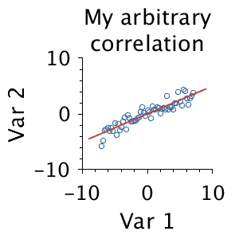

### About Pubfig
Pubfig is a collection of tools facilitating the plotting of reproducible, publication-quality figures with Matlab.

### Rationale
Matlab's plotting libraries are extremely powerful, yet the default settings produce questionable figures in terms of readability and aesthetics.

Pubfig provides simple-to-use utilities through which Matlab figure- and axes handles can be passed, resulting in publication-quality figures within a wide range of common figure sizes - without the need to meticulously adjust multiple dozen figure and axes properties.

In addition, pubfig provides a git-based tool to keep track of relevant files used to produce a particular plot. In scientific practise it frequently happens that multiple, distributed data sources (often also distributed over multiple git repositories) are queried to generate a plot via constantly evolving plotting routines. This can become a problem when a figure needs to be reproduced at a later time point, and both data and code has changed. Pubfig provides a utility with which relevant git commit and blob hashes can be tracked over multiple repositories, facilitating figure reproducibility months, or years later.

### Usage
The common usage pattern is illustrated in `/examples/pubfig_simple.m`, together with example plots. The extended use case combined with git hash tracking is shown in `/examples/pubfig_git.m`. For detailed documentation, consult the docstrings in the relevant source code files.
